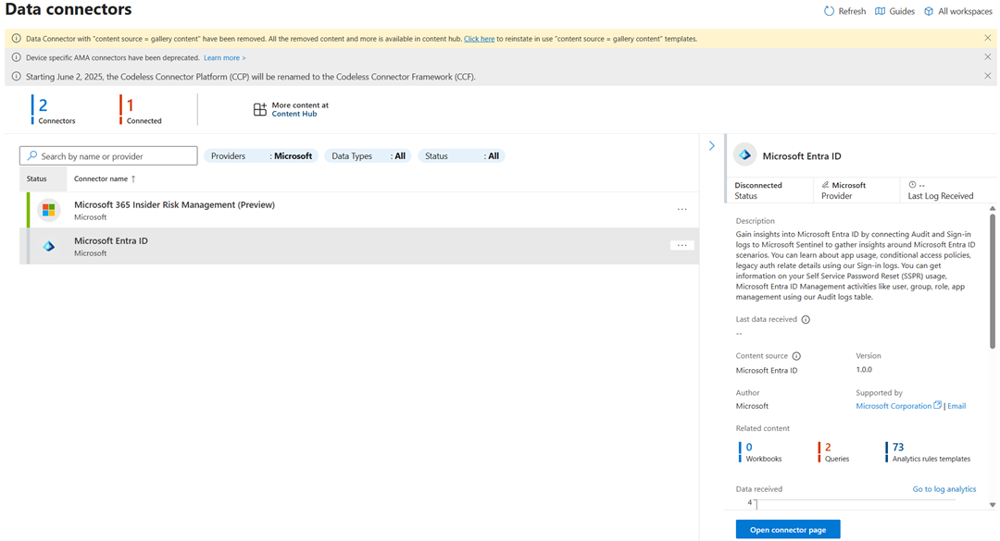
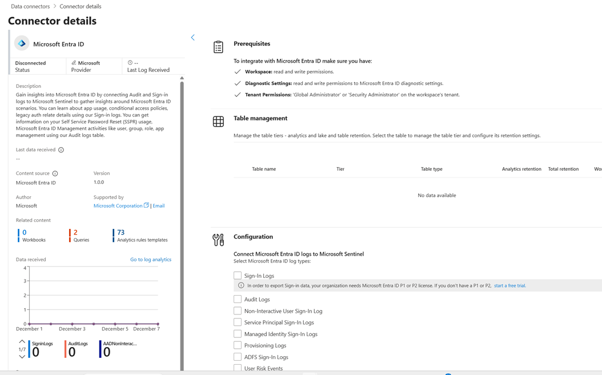

# Procédure d’embarquement de Microsoft Entra ID dans Sentinel

Version 1.0
Date : 2025-12-08

## Table des matières
1. Description de la solution Microsoft Entra ID  
2. Prérequis   
3. Types de données du connecteur de données Microsoft Entra ID  	
4. Étapes d’installation   
5. Activation du connecteur   
6. Validation   
7. Sources   

## 1. Description de la solution Microsoft Entra ID  
La solution Microsoft Entra ID pour Microsoft Sentinel permet d’ingérer, via les paramètres de diagnostic, les journaux Microsoft Entra ID suivants dans Microsoft Sentinel : Audit, Connexions (Sign-in), Provisionnement, Événements de risque et Utilisateurs/Principaux de service à risque.

### Contenu de la solution Microsoft Entra ID :  
    Data Connectors: 1,   
    Workbooks: 2,   
    Analytic Rules: 63,    
    Playbooks: 11,   
    Classeur : 2  

## 2. Prérequis  

- Une licence ID de charge de travail Microsoft Entra Premium (Microsoft Entra Workload ID Premium) est requise pour pouvoir envoyer les journaux AADRiskyServicePrincipals et ADServicePrincipalRiskEvents vers Microsoft Sentinel.   
- Une licence Microsoft Entra ID P1 ou P2 est nécessaire pour ingérer les journaux de connexion dans Microsoft Sentinel. Toute licence Microsoft Entra ID (gratuite/O365/P1/P2) est suffisante pour ingérer les autres types de journaux. D’autres frais par gigaoctet peuvent s’appliquer à Azure Monitor (Log Analytics) et à Microsoft Sentinel. 
- Le rôle Contributeur Microsoft Sentinel doit être attribué à votre utilisateur sur l’espace de travail. 
- Votre utilisateur doit avoir le rôle Administrateur de la sécurité sur le tenant à partir duquel vous souhaitez diffuser en continu les journaux, ou les autorisations équivalentes. 
- Votre utilisateur doit disposer d’autorisations en lecture et en écriture sur les paramètres de diagnostic Microsoft Entra pour pouvoir voir l’état de la connexion. 

## 3. Types de données du connecteur de données Microsoft Entra ID  	
Ce tableau répertorie les journaux que vous pouvez envoyer depuis Microsoft Entra ID vers Microsoft Sentinel en utilisant le connecteur de données Microsoft Entra ID. Microsoft Sentinel stocke ces journaux dans l’espace de travail Log Analytics lié à votre espace de travail Microsoft Sentinel. 

| **Type de journal**                                                                                                                                                                            | **Description**                                                                                                                                                                                                                                                                        | **Log schema**                                                                                                                            |
| ---------------------------------------------------------------------------------------------------------------------------------------------------------------------------------------------- | -------------------------------------------------------------------------------------------------------------------------------------------------------------------------------------------------------------------------------------------------------------------------------------- | ----------------------------------------------------------------------------------------------------------------------------------------- |
| [**Journaux d’audit**](https://learn.microsoft.com/fr-fr/azure/active-directory/reports-monitoring/concept-audit-logs)                                                                         | Activité système liée à la gestion des utilisateurs et des groupes, aux applications gérées et aux activités d’annuaire.                                                                                                                                                               | [AuditLogs](https://learn.microsoft.com/fr-fr/azure/azure-monitor/reference/tables/auditlogs)                                             |
| [**Journaux de connexion**](https://learn.microsoft.com/fr-fr/azure/active-directory/reports-monitoring/concept-all-sign-ins)                                                                  | Connexions utilisateur interactives où un utilisateur fournit un facteur d’authentification.                                                                                                                                                                                           | [SigninLogs](https://learn.microsoft.com/fr-fr/azure/azure-monitor/reference/tables/signinlogs)                                           |
| [**Journaux de connexion utilisateur non interactifs**](https://learn.microsoft.com/fr-fr/azure/active-directory/reports-monitoring/concept-all-sign-ins#non-interactive-user-sign-ins)        | Connexions effectuées par un client pour le compte d’un utilisateur sans interaction ni facteur d’authentification de l’utilisateur.                                                                                                                                                   | [AADNonInteractiveUserSignInLogs](https://learn.microsoft.com/fr-fr/azure/azure-monitor/reference/tables/aadnoninteractiveusersigninlogs) |
| [**Journaux de connexion du service principal**](https://learn.microsoft.com/fr-fr/azure/active-directory/reports-monitoring/concept-all-sign-ins#service-principal-sign-ins)                  | Connexions par applications et principaux de service qui n’impliquent aucun utilisateur. Dans ces connexions, l’application ou le service fournit des informations d’identification pour son propre compte afin de s’authentifier ou d’accéder à des ressources.                       | [AADServicePrincipalSignInLogs](https://learn.microsoft.com/fr-fr/azure/azure-monitor/reference/tables/aadserviceprincipalsigninlogs)     |
| [**Journaux de connexion d’identité managée**](https://learn.microsoft.com/fr-fr/azure/active-directory/reports-monitoring/concept-all-sign-ins#managed-identity-for-azure-resources-sign-ins) | Connexions par les ressources Azure qui ont des secrets gérés par Azure. Pour plus d’informations, consultez [Qu’est-ce que les identités managées pour les ressources Azure ?](https://learn.microsoft.com/fr-fr/azure/active-directory/managed-identities-azure-resources/overview). | [AADManagedIdentitySignInLogs](https://learn.microsoft.com/fr-fr/azure/azure-monitor/reference/tables/aadmanagedidentitysigninlogs)       |
| [**Journaux de connexion AD FS**](https://learn.microsoft.com/fr-fr/entra/identity/monitoring-health/concept-usage-insights-report#ad-fs-application-activity)                                 | Connexions effectuées via Services de fédération Active Directory (AD FS).                                                                                                                                                                                                             | [ADFSSignInLogs](https://learn.microsoft.com/fr-fr/azure/azure-monitor/reference/tables/adfssigninlogs)                                   |
| [**Journaux d’audit Office 365 enrichis**](https://learn.microsoft.com/fr-fr/entra/global-secure-access/how-to-view-enriched-logs)                                                             | Événements de sécurité liés aux applications Microsoft 365.                                                                                                                                                                                                                            | [EnrichedOffice365AuditLogs](https://learn.microsoft.com/fr-fr/azure/azure-monitor/reference/tables/enrichedmicrosoft365auditlogs)        |
| [**Journaux d’approvisionnement**](https://learn.microsoft.com/fr-fr/azure/active-directory/reports-monitoring/concept-provisioning-logs)                                                      | Informations sur l’activité système sur les utilisateurs, les groupes et les rôles provisionnés par le service d’approvisionnement Microsoft Entra.                                                                                                                                    | [AADProvisioningLogs](https://learn.microsoft.com/fr-fr/azure/azure-monitor/reference/tables/aadprovisioninglogs)                         |
| [**Journaux d’activité Microsoft Graph**](https://learn.microsoft.com/fr-fr/graph/microsoft-graph-activity-logs-overview)                                                                      | Requêtes HTTP accédant à des ressources de votre locataire via l’API Microsoft Graph.                                                                                                                                                                                                  | [MicrosoftGraphActivityLogs](https://learn.microsoft.com/fr-fr/azure/azure-monitor/reference/tables/microsoftgraphactivitylogs)           |
| [**Journaux du trafic d’accès réseau**](https://learn.microsoft.com/fr-fr/entra/global-secure-access/how-to-view-traffic-logs)                                                                 | Trafic et activités d’accès réseau.                                                                                                                                                                                                                                                    | [NetworkAccessTraffic](https://learn.microsoft.com/fr-fr/azure/azure-monitor/reference/tables/networkaccesstraffic)                       |
| [**Journaux de santé du réseau à distance**](https://learn.microsoft.com/fr-fr/entra/global-secure-access/how-to-remote-network-health-logs?tabs=microsoft-entra-admin-center)                 | Informations sur l’intégrité des réseaux distants.                                                                                                                                                                                                                                     | [RemoteNetworkHealthLogs](https://learn.microsoft.com/fr-fr/azure/azure-monitor/reference/tables/remotenetworkhealthlogs)                 |
| [**Événements à risque utilisateur**](https://learn.microsoft.com/fr-fr/entra/id-protection/howto-identity-protection-investigate-risk?branch=main#risk-detections-report)                     | Événements à risque utilisateur générés par Microsoft Entra ID Protection.                                                                                                                                                                                                             | [AADUserRiskEvents](https://learn.microsoft.com/fr-fr/azure/azure-monitor/reference/tables/aaduserriskevents)                             |
| [**Utilisateurs à risque**](https://learn.microsoft.com/fr-fr/entra/id-protection/howto-identity-protection-investigate-risk#risky-users-rport)                                                | Utilisateurs à risque enregistrés par Microsoft Entra ID Protection.                                                                                                                                                                                                                   | [AADRiskyUsers](https://learn.microsoft.com/fr-fr/azure/azure-monitor/reference/tables/aadriskyusers)                                     |
| [**Principaux de service à risque**](https://learn.microsoft.com/fr-fr/entra/id-protection/howto-identity-protection-investigate-risk?branh=main#risk-detections-report)                       | Informations sur les "service principals" marqués comme risqués par Microsoft Entra ID Protection.                                                                                                                                                                                     | [AADRiskyServicePrincipals](https://learn.microsoft.com/fr-fr/azure/azure-monitor/reference/tables/aadriskyserviceprincipals)             |
| [**Événements de risque liés au service principal**](https://learn.microsoft.com/fr-fr/entra/id-protection/howto-identity-protection-investigate-risk#risy-users-report)                       | Détections de risques associées aux principaux de service enregistrés par la Protection Microsoft Entra ID.                                                                                                                                                                            | [AADServicePrincipalRiskEvents](https://learn.microsoft.com/fr-fr/azure/azure-monitor/reference/tables/aadserviceprincipalriskevents)     |

## 4. Étapes d’installation   
Le connecteur n’est pas installé par défaut, mais il est inclus dans la solution Microsoft Entra ID qui est fournie par Microsoft dans le Content Hub de Sentinel. Les solutions incluses dans Content Hub ont besoin d’être d’installées pour qu’elles puissent être utilisées dans Sentinel. Pour installer la solution Microsoft Entra ID et activer le connecteur, veuillez suivre les étapes suivantes:
- Depuis le portail Azure, allez dans Sentinel, sélectionnez le workspace cible. 
- Allez dans : Sentinel > Gestion de contenu > Content Hub, 
- Cherchez et installer la solution: Microsoft Entra ID

## 5. Activation du connecteur   

Après installation de la solution Microsoft Entra ID dans Sentinel, le connecteur Microsoft Entra ID est ajouté dans la liste des connecteurs. 
Afin de pouvoir configurer le connecteur, veuillez suivre les étapes suivantes:
- Rendez-vous dans : Sentinel > Configuration > Connecteur de données
- Sélectionnez le Connecteur pour afficher ses détails  

> La section contient une description du connecteur et elle contient la liste des types de logs couverts et les statistiques des données ingérés. Cela permettra aussi de valider la configuration lorsque le connecteur sera activé. 

- Cliquez sur Open connector page.

> La page du connecteur affiche les prérequis pour l’activation du connecteur et la possibilité de choisir les logs à envoyer vers Sentinel

Accès requis pour configurer le connecteur :
| Espace | Permissions | 
| ------ | ----------- |
| Workspace | Lecture et écriture |
| Diagnostic Settings | Lecture et écriture Microsoft Entra ID diagnostic settings |
| Tenant | 'Global Administrator' ou  'Security Administrator' sur le locataire contenant le workspace |

- Il faudrait sélectionner les logs à couvrir et cliquer sur Apply change

> Après activation du connecteur, une règle est ajoutée automatiquement pour l’envoi des logs depuis Entra Diagnostic settings vers Sentinel:

## 6. Validation   
### Méthode 1 : 
Depuis Sentinel > Configuration > Connecteurs de données, On peut afficher les statistiques des données ingérés en cliquant le connecteur : Microsoft Entra ID.

### Méthode 2 :
À partir de Sentinel > Logs, faire une requête KQL pour afficher le contenu des tables suivantes:

>SigninLogs  
AuditLogs  
AADNonInteractiveUserSignInLogs  
AADServicePrincipalSignInLogs  
AADManagedIdentitySignInLogs  
AADProvisioningLogs  
ADFSSignInLogs  
AADUserRiskEvents  
AADRiskyUsers  
NetworkAccessTraffic  
AADRiskyServicePrincipals  
AADServicePrincipalRiskEvents  
MicrosoftGraphActivityLogs  
EnrichedOffice365AuditLogs  
RemoteNetworkHealthLogs  

## 7. Sources  

https://learn.microsoft.com/en-us/azure/sentinel/connect-azure-active-directory 
