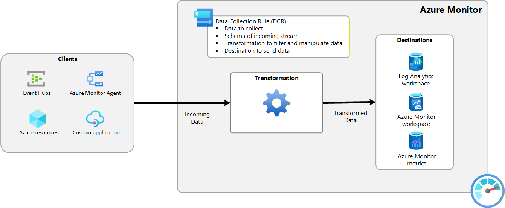

# Revue des règles de collection des données DCR


**Version** : 1.0
**Date de production**: 2025-12-10


## Table des matières
1. Introduction
2. Principe de fonctionnement
3.

## 1. Introduction
Les Data Collection Rules (DCR) introduisent une approche normalisée de collecte des données dans Azure Monitor, basée sur un pipeline ETL (extraction, transformation, chargement). Elles permettent une configuration uniforme des différentes sources de données, offrent la possibilité d’appliquer des transformations avant l’ingestion et s’intègrent facilement dans des pratiques IaC/DevOps. Dans la majorité des cas, Azure Monitor crée automatiquement les DCR, mais leur gestion manuelle permet une personnalisation avancée du flux de collecte.


## DCR sur Monitor

Pour afficher les DCR existantes, allez dans:   
Azure > Monitor > Settings > Data Collection Rules 


## Processus de collecte des données

Les DCR définissent comment Azure Monitor doit traiter les données entrantes : quelles données collecter, leur format, les transformations éventuelles et la destination d’ingestion. Elles fournissent un pipeline de traitement unifié pour tous les scénarios de collecte.




## Associations des règles de collecte des données (DCRA)

Les DCRAs établissent le lien entre une DCR et une ressource. Comme la relation est many-to-many, une DCR peut servir plusieurs ressources et une ressource peut utiliser plusieurs DCR (jusqu’à 30).

``` mermaid

flowchart LR
    subgraph DCRA
        Ressource <--> DCRA <--> DCR
    end
    
```