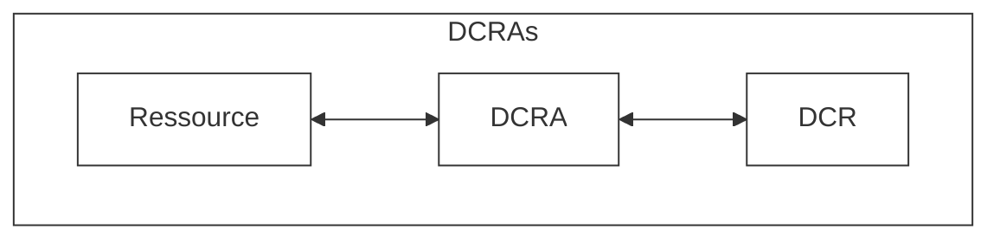
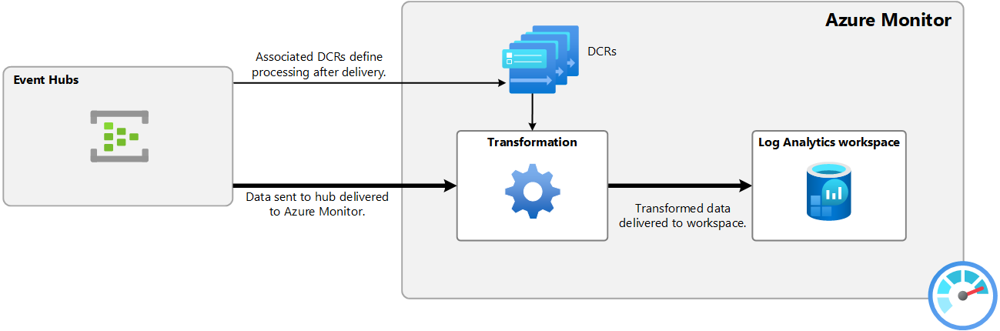
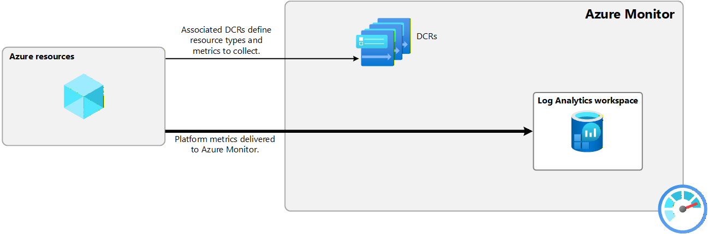
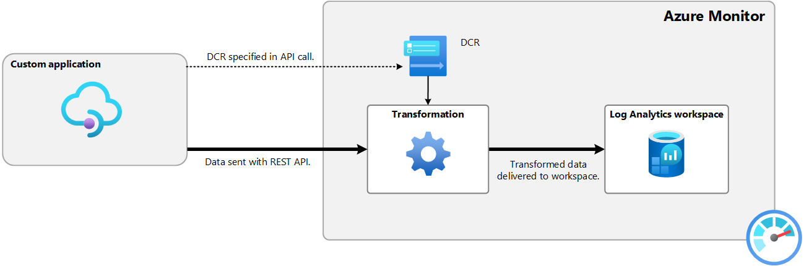
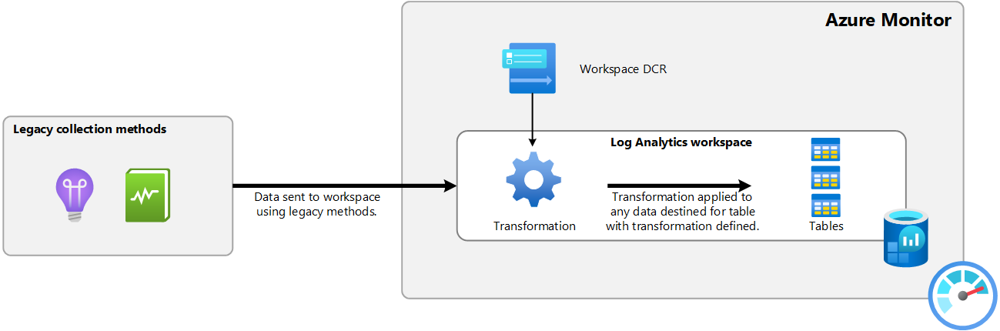
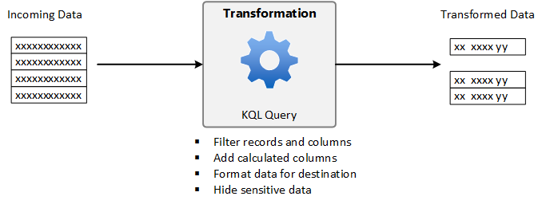
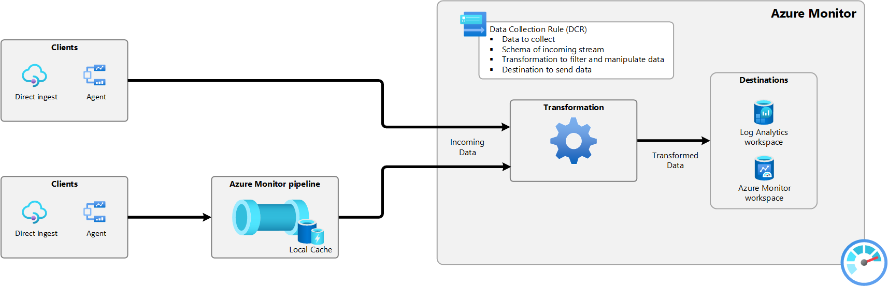

# Revue des règles de collection des données DCR

**Version** : 1.0
**Date de production**: 2025-12-10

## Table des matières
1. Introduction
2. Principe de fonctionnement
3.

## 1. Introduction
Les Data Collection Rules (DCR) introduisent une approche normalisée de collecte des données dans Azure Monitor, basée sur un pipeline ETL (extraction, transformation, chargement). Elles permettent une configuration uniforme des différentes sources de données, offrent la possibilité d’appliquer des transformations avant l’ingestion et s’intègrent facilement dans des pratiques IaC/DevOps. Dans la majorité des cas, Azure Monitor crée automatiquement les DCR, mais leur gestion manuelle permet une personnalisation avancée du flux de collecte.

## DCR sur Monitor

Pour afficher les DCR existantes, allez dans:   
Azure > Monitor > Settings > Data Collection Rules 

## Processus de collecte des données

Les DCR définissent comment Azure Monitor doit traiter les données entrantes : quelles données collecter, leur format, les transformations éventuelles et la destination d’ingestion. Elles fournissent un pipeline de traitement unifié pour tous les scénarios de collecte.

## Associations des règles de collecte des données (DCRA)

Les DCRAs établissent le lien entre une DCR et une ressource. Comme la relation est many-to-many, une DCR peut servir plusieurs ressources et une ressource peut utiliser plusieurs DCR (jusqu’à 30).

## Usage d'un DCR

une fois une DCR est créée, il existe plusieurs façons pour l'utiliser:

| Scenario                     | Method                                                              |
|------------------------------|---------------------------------------------------------------------|
| Azure Monitor agent (AMA)    | Data collection rule association (DCRA)                             |
| Event hubs                   | Data collection rule association (DCRA)                             |
| Platform metrics (preview)   | Data collection rule association (DCRA)                             |
| Direct ingestion             | DCR spécifié dans l'appel d'API Azure Monitor. |
| Workspace transformation DCR | La DCR est activée pour le workspace.            |

## Scénarios d'utilisation
Cette section décrit les scnénarios d'usage des DCR les plus communs.

### Azure Monitor agent (AMA)  

L’agent AMA collecte les données des VMs et clusters Kubernetes en suivant les instructions définies dans les DCR. Après installation, l’agent récupère les DCR associées, détermine quelles données collecter (événements, performances, métriques Prometheus) puis envoie ces données à Azure Monitor. Les transformations définies dans la DCR sont exécutées avant que les données ne soient stockées dans le workspace et la table cible.

### Event hubs

Azure Monitor peut ingérer des données provenant d’Event Hubs. À la réception des données, Azure Monitor applique les transformations définies dans les DCR associées, puis les transmet aux destinations configurées (Log Analytics workspace, tables…).

### Métriques des plateformes
Les métriques de plateforme Azure sont collectées automatiquement. Une DCR peut désormais rediriger ces métriques vers Log Analytics pour une analyse avancée via KQL, remplaçant ainsi l’usage traditionnel des diagnostic settings.

### Direct ingestion

En ingestion directe, chaque requête API désigne explicitement la DCR responsable du traitement. La DCR valide la structure des données, applique les transformations nécessaires et dirige l’ingestion vers le workspace et la table cibles.

### Workspace transformation DCR
Les workspace-transformation-DCRs permettent d’appliquer des transformations aux données entrant dans un Log Analytics workspace, même lorsque la source n’utilise pas de DCR. Une fois créées, elles s’activent automatiquement.

## Transformations

Les transformations KQL appliquées via une DCR modifient les données avant leur stockage. Elles servent à filtrer, anonymiser, reformater ou enrichir les données, et permettent des scénarios avancés comme l’ingestion multi-destinations.

## Azure Monitor pipeline
Le pipeline Azure Monitor permet de collecter et router la télémétrie à grande échelle dans un datacenter local avant son envoi au cloud. Il répond à trois besoins :

haute scalabilité,

connectivité intermittente (cache + synchronisation différée),

réseaux segmentés où l’accès direct au cloud n’est pas possible.

